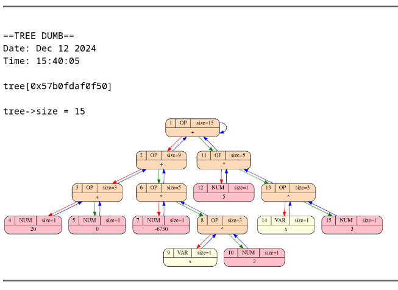

# Дифферинциатор

Проект представляет собой программу для дифференцирования математических выражений и вычисления их разложения в ряд Тейлора. Также реализована функция упрощения дерева, и его графический дамп. Результат выводится в виде PDF-файла, содержащего исходное выражение, упрощённое выражение и графики функций, построенные с помощью библиотеки **GNUplot**.
 
## Установка и запуск

### Зависимости
- **GNUplot**: Для построения графиков функций.
- **Graphviz**: Для дампа синтаксического дерева.
- **Tex (c поддержкой русского)**: Для создания отчёта и вывода результата в PDF-файле.
- **GCC**: Для сборки проекта.
- **Make**: Для управления сборкой проекта.

### Сборка и запуск
1. Клонируйте репозиторий с проектом:
    ```bash
    git clone <репозиторий>
    cd <папка_проекта>
    ```
2. Соберите и запустите проект:
   ```bash
   make OPTS="-i [path/to/input.txt] -o [path/to/output/dir/] -m [ndiff/taylor]"
   ```

## Реализация

### Структура проекта

```
./
├── assets                # Примеры входных и выходных файлов
├── libs                  # Внешние библиотеки
│   ├── gnuplot           # Модуль для работы с gnuplot
│   └── logger            # Модуль для логированияпроекта
└── src                   # Основной исходный код проекта
    ├── flags             # Модуль для обработки флагов командной строки
    ├── main.c            # Точка входа в программу
    ├── mode_funcs.c      # Функции для работы с режимами (дифференцирование, Тейлор)
    ├── mode_funcs.h
    ├── tree              # Модуль для работы с синтаксическим деревом
    │   ├── funcs         # Функции для работы с деревом
    │   ├── operation     # Функции обработки операций над деревом
    │   ├── structs.h     # Структуры данных дерева
    │   └── verification  # Верификация и дамп дерева
    └── utils             # Вспомогательные утилиты
```

### Грамматика

Математическое выражение, находящееся во входном файле должно быть написано согласно данной грамматике:

```bnf
<start> ::= <sum> "$"
<sum> ::= <mul> (("+" | "-") <mul>)*
<mul> ::= <pow> (("*" | "/") <pow>)*
<pow> ::= <func> ("^" <pow>)*

<func> ::= <binary_func> | <unary_func> | <brakets>
<binary_func> ::= 
    <binary_func_names> 
        "{" <sum> "}"
        "{" <sum> "}" 
<unary_func> ::= <unary_func_names> "{" <sum> "}"
<unary_func_names> ::= 
    "sin" | "cos " | "tg" | "ctg" | 
    "arcsin" | "arccos" | "arctg" | "arcctg" |
    "sh" | "ch" | "th" | "cth" | "ln"
<binary_func_names> ::= "log"

<brakets> ::= "(" <sum> ")" | <num_var>
<num_var> ::= <double> | <var>
<double> ::= "e" | "-"? <uint> ("." [0-9]*)?
<uint> ::= "0" | [1-9] [0-9]*
<var> ::= [a-d] | [f-z]
```

## Функционал

### 1. Дифференцирование
- Пользователь выбирает переменную дифференцирования и порядок производной.
- Программа строит синтаксическое дерево методом рекурсивного спуска.
- Упрощает тривиальные констуркции (свёртка констант, умножение на 0 и т.д.)
- Обходит дерево и создаёт новое, которое в математичемском смысле является производной от данного. Это повторяется количество раз равное степени дифферинцирования.
- Линии исходной функции и полученной производной строятся на одном графике при помощи **GNUplot**
- Всё вышеперечисленное записывается в tex-файл, и он собирается в PDF.

### 2. Разложение в ряд Тейлора
- Пользователь выбирает точку и степень разложения.
- Программа строит синтаксическое дерево методом рекурсивного спуска.
- Упрощает тривиальные констуркции (свёртка констант, умножение на 0 и т.д.)
- Для каждого порядка разложения находит n-ую производную по алгоритму из режима работы 1 и вычисляет соответствующий моном в данноу точке разложения, который добавляется к итоговому полиному.
- Линии исходной функции и полученного полинома строятся на одном графике при помощи **GNUplot**
- Всё вышеперечисленное записывается в tex-файл, и он собирается в PDF.

## Реализация

### Синтаксическое дерево

Дерево реализовано как структура, где каждая нода содержит:

- **Данные** - union, в котором может лежать либо число, либо переменная, либо код операции. 
- **Указатели на родителя и левое и правое поддеревья** - Для учебной практики было решено поддерживать указатель на родителя, который может быть удобен в некоторых частных случая обработки дерева

#### Ключевые функции для работы с деревом

- **Дифференцирование**: создаёт новое дерево, в котором содержиться производная исходного. Обработка операций происходит посредством кодогенерации, в которой для каждой операции определена функция создающая дерево в виде её производной (константы и переменные обрабатываютяс отдельно тривиалььным образом)

- **Считывание из файла**: Реализован рекурсивным спуском. Для читабельности кода используется локальный DSL основанный на макросах

- **Вывод**: Первая функция выводит дерево в формате грамматики, описанной выше. Нужна для отладки и сохранения исходной функции для переиспользования. Вторая функция выводит в формате tex, для генерации PDF. В обоих случаях учитывается приоритет операций, поэтому лишние скобки не выводятся, что сильно упрощает читаемость

- **Упрощение**: Убирает тривиальные операции, чтобы уменьшить размер дерева и итоговой формулы. Обрабатываются следующие случаи:
    - Свёртка констант (реализована кодогенерацией)
    - Умножение на 0 и 1 слева и справа
    - Сложение и вычитание с 0 слева и справа
    - Деление 0 на другой операнд

> Если при преобразованиях возникает деление на ноль, либо же другие недопустимые математические операции, то возвращается соответствующая ошибка

- **Верификация дерева**: Проверка корректности структуры дерева (используется только в дебажном режиме).

- **Графический дамп**: Визуализация дерева с помощью Graphviz
    